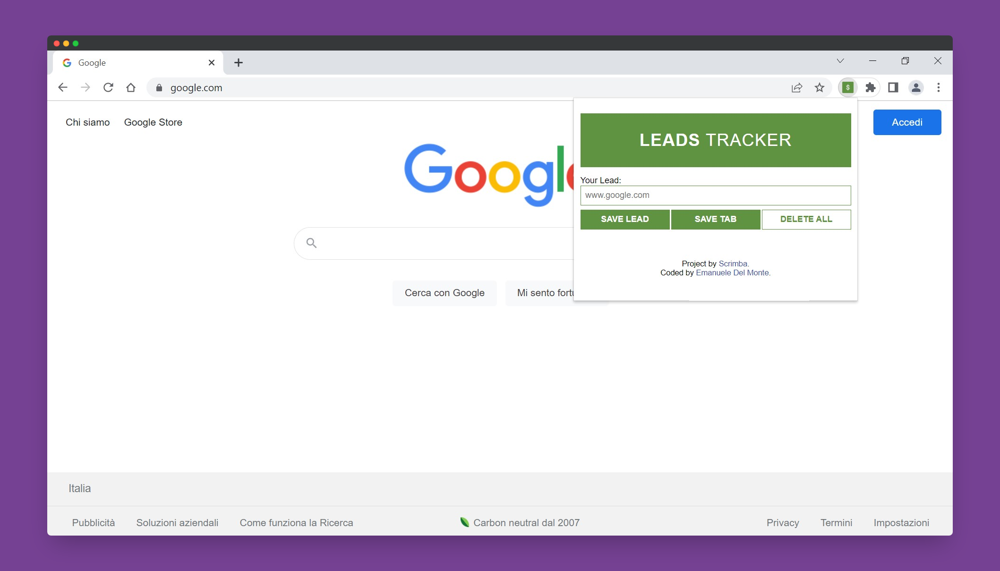

# Scrimba - Chrome extension leads tracker solution

This is a solution to the [Chrome extension leads tracker project on Scrimba](https://scrimba.com/learn/learnjavascript/). Scrimba helps you improve your coding skills by building realistic projects.

## Table of contents

- [Overview](#overview)
  - [The challenge](#the-challenge)
  - [Screenshot](#screenshot)
  - [Links](#links)
  - [How to install](#how-to-install)
- [My process](#my-process)
  - [Built with](#built-with)
  - [What I learned](#what-i-learned)
  - [Continued development](#continued-development)
  - [Useful resources](#useful-resources)
- [Author](#author)
- [Acknowledgments](#acknowledgments)

## Overview

### The challenge

Users should be able to:

- Save leads writing them into the input element
- Save the current Chrome tab in the list
- Maintain leads even after closing the browser
- Delete all leads by double clicking on the last button
- See hover states for interactive elements

### Screenshot



### Links

- Solution URL: [@GitHub](https://github.com/xdelmo/chrome-extension-leads-tracker)
- Live Site URL: [@GitHub](https://htmlpreview.github.io/?https://github.com/xdelmo/chrome-extension-leads-tracker/blob/master/index.html)

### How to install

- Clone Repo or Download Zip
- Visit chrome://extensions/ and turn on "Developer mode"
- Click "Load unpacked" button and navigate to the folder you downloaded
- That's it! 🎉

## My process

### Built with

- Semantic HTML5 markup
- CSS custom properties
- CSS Grid Layout
- Mobile-first workflow
- Vanilla Javascript
- Google Chrome APIs

### What I learned

With this project I improved a lot my JS skills. The newest things I learnt are:

- How to get the active Chrome tab and store it into localStorage using JSON's methods

```js
tabBtn.addEventListener("click", function () {
  chrome.tabs.query({ active: true, currentWindow: true }, function (tabs) {
    myLeads.push(tabs[0].url);
    localStorage.setItem("myLeads", JSON.stringify(myLeads));
    render(myLeads);
  });
});
```

- How to use "template string" with backtick manipulating directly the DOM

```js
function render(leads) {
  let listItems = "";
  for (let i = 0; i < leads.length; i++) {
    listItems += `<li>
                        <a target="_blank" href="${leads[i]}">
                        ${leads[i]}
                        </a>
                </li>`;
  }
  ulEl.innerHTML = listItems;
}
```

### Continued development

I'd like to:

- Give the ability to select which leads to remove from the list
- Improve UI

### Useful resources

- [Javatpoint](https://www.javatpoint.com/javascript-dblclick-event) - This helped me to implement double click event on the delete button
- [Stackoverflow](https://stackoverflow.com/questions/6718256/how-do-you-use-chrome-tabs-getcurrent-to-get-the-page-object-in-a-chrome-extensi) - Simple method to get the active Chrome tab

## Author

- Website - [Emanuele Del Monte](https://www.emanueledelmonte.it)

## Acknowledgments

A big thank you to [Per Harald Borgen](https://github.com/perborgen) who is a pleasure to listen to and to learn new things in a funny and interactive way 👏
